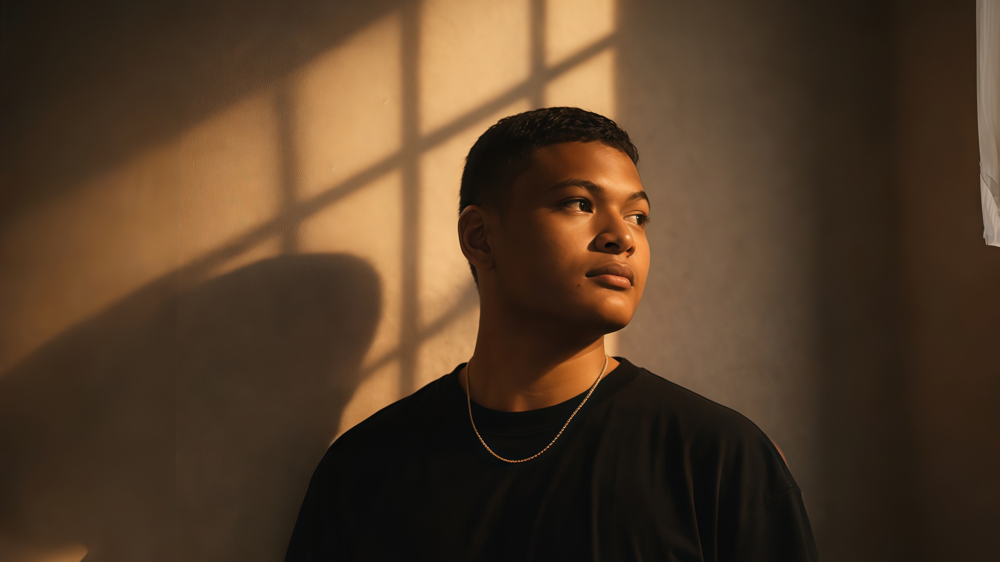

<h1 align="center">Hi, I'm Aufa Wicaksono</h1> 
<h3 align="center">Aspiring Software Engineer & Fullstack Developer 🚀</h3>

Building modern web applications with clean UI, scalable backend, and meaningful user experiences.

Currently on a new journey — gaining experience, improving skills, and growing through real projects.

  

  
🛠️ Tech Stack  Frontend 
  
Backend 
  
Database 
  
Tools 
  
 
 ✨ “Code. Learn. Build. Improve.” ✨ 

